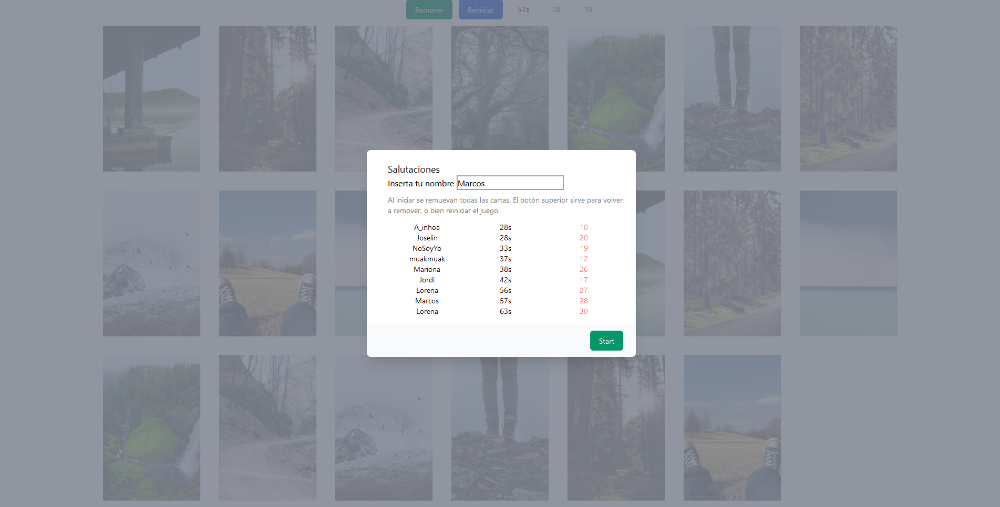
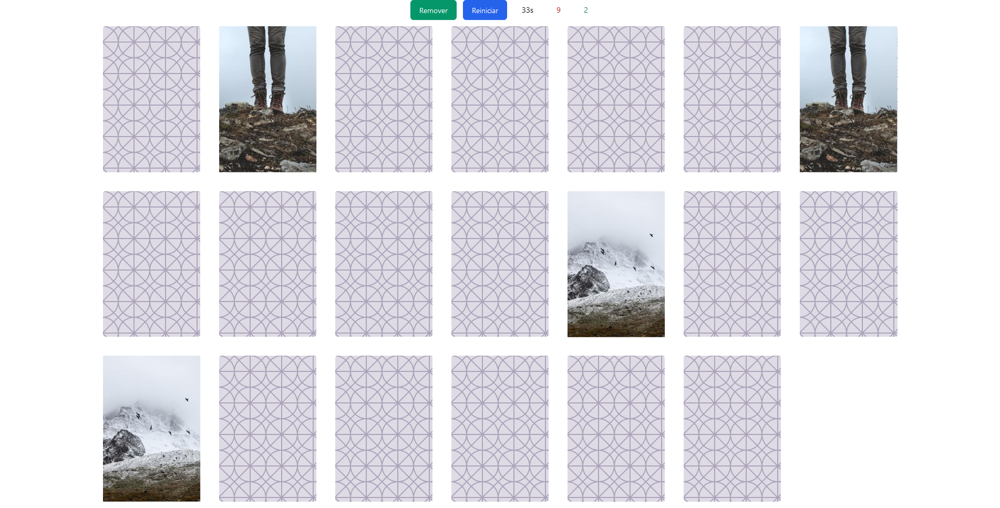

## Github pages
https://jordicher.github.io/parejas/

Este proyecto se menciona en el video de youtube
Construye un portafolio de desarrollo | yo reaccionaré a tu código
Abrir [https://www.youtube.com/watch?v=aouDQ8caJYg&t=477s&ab_channel=HolaMundo](videoYoutube)

CSS estoy aprendiendo tailwind y lo utilizo en este proyecto.
Js, no se ha buscado ejercicios similares... Simplemente como encararia en este momento yo el ejercicio.
Base de datos he utilizado firebase.

